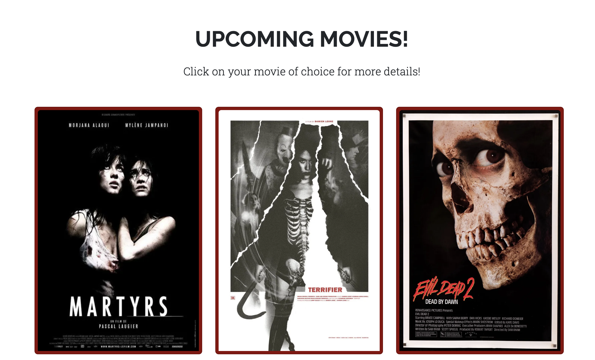
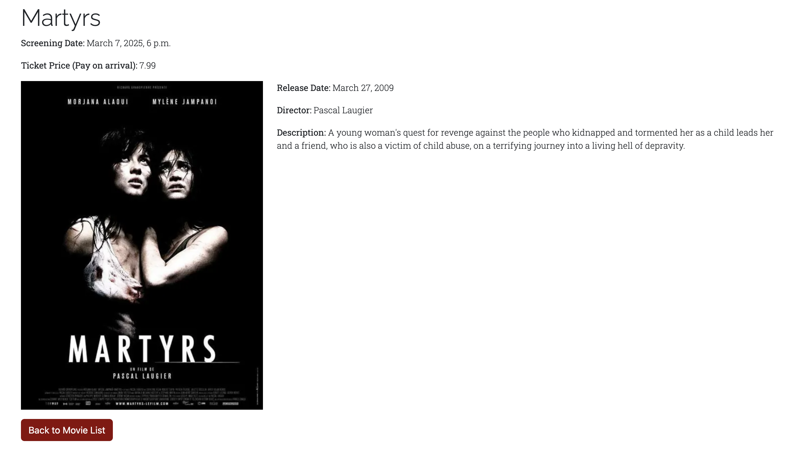
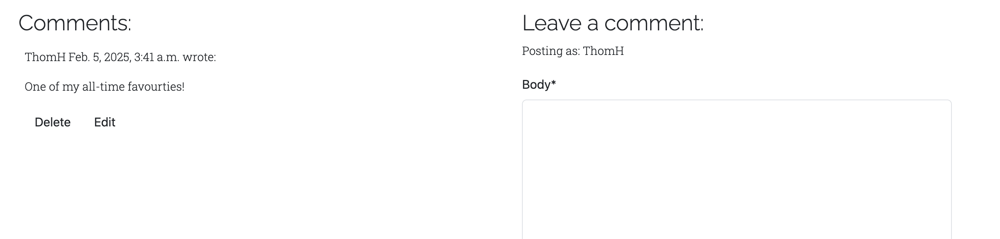
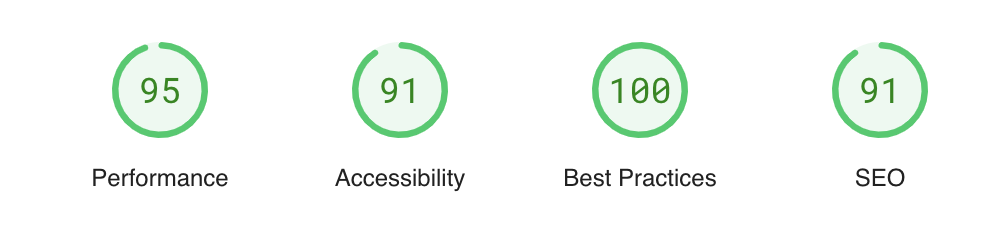

# Introduction

# scream-screenings

### Project Description - A Django project for a website that hosts monthly horror film screenings at a local event bar.

### Project Purpose - Its purpose is to connect horror fans in the local area and to tell them about monthly movie screenings of some of the best horror movies ever made.

### How it benefits the Users, Users Demographic - It targets horror and movie fans of all ages. By implementing a comment section it allows for them to talk and be part of a community.

# Features

**Navbar**

- Featured on all pages, the fully responsive navigation bar includes links to the home page, movie gallery, register page and login. It is identical on each page to facilitate easy navigation.
- This section allows users to navigate seamlessly between pages on all devices without needing to use the 'back' button.

  

Navbar Screenshot

  

  

**Movie Gallery**

- This section highlights the up-coming movies that are being screened.
- It provides a clean design with each image being a link to the movies details page.

  

Movie Screenshot

  

  

**Movie Details Section**

- This section details the movies information. Release date, short synopsis and director, as well as pricing and screening date for the movie.
- This section is valuable to the user as they will be able to see if the movie is something like to see by reading the description as well as providing information for the screening.

  

Detail Screenshot

  

  

**Comment Section**

- At the bottom of the movie detail page is a comment section for users of the webpage to discuss the movies that are being screened.
- Creates a community feeling, where users can meet and talk to those with similar interests.

  

Comment Screenshot

  

  

**The Footer**

- The footer section includes links to the relevant social media sites for Scream Screenings. The links will open to a new tab to allow easy navigation for the user.
- The footer is valuable to the user as it encourages them to keep connected via social media.

  

Footer Screenshot

   

  

## Future Features

While the current version of the project is fully functional, we have some exciting features planned for future updates. Here are a few ideas that we didn't have time to implement in this release:

1. **Blog Functionality**:
   - Further implementing a community element of the webpage to help those with similar interests find each other and communicate.
2. **Online Ticket Booking**:
   - Implement a booking system that allows users to buy tickets to the events instead of doing a at the door ticket selling policy.

## Manual Testing

#### Features Testing

| Feature            | Action                               | Effect                                      |
| ------------------ | ------------------------------------ | ------------------------------------------- |
| Logo               | Click                                | Brings back to Home page                    |
| Navbar Links       | Click on Movies                      | Opens Movie List page                       |
|                    | Click on About                       | Opens About page                            |
|                    | Click on Register                    | Opens sign-up page                          |
| Movie List page    | Click on Movie poster card           | Opens move detail page                      |
| Login page         | Fill out the form and submit         | If details are authenticated, log in        |
|                    | Attempt to submit empty              | Error pops up in field that's left empty    |
| Sign-up page       | Fill out the form and submit         | If details pass restrictions, create a user |
|                    | Attempt to submit wrong data         | Error pops up in field that's wrong         |
| Social Media Links | Test Instagram link                  | Instagram opens in a separate tab           |
|                    | Test Facebook link                   | Facebook opens in a separate tab            |
|                    | Test Twitter link                    | Twitter opens in a separate tab             |
| Comment Section    | Fill out comment form and submit     | Posts comment                               |
|                    | Attempt to submit empty comment form | Error pops up in field that's left empty    |

#### Lighthouse

**Introduction**
This report presents the results of Lighthouse testing conducted to assess the performance, accessibility, best practices, SEO, and PWA compliance of [Website Name].

**Test Execution**
Lighthouse tests were executed using the Google Chrome browser's DevTools.

**Test Metrics**

- Performance Score: 95
- Accessibility Score: 91
- Best Practices Score: 100
- SEO Score: 91

**Detailed Results**

- **Performance**: The website's performance score is 95, indicating good overall performance.
- **Accessibility**: The website excels in accessibility, with a score of 91, indicating strong adherence to accessibility standards. Minimal accessibility issues were detected.
- **Best Practices**: The website follows best practices with a score of 100.
- **SEO**: SEO performance is strong, with a score of 91.

**Visuals**

#### Browsers

**Supported Browsers and Devices**
Our web application is officially tested and supported on the following browsers and devices:

- Google Chrome (latest version)
- Brave (latest version)
- Mozilla Firefox (latest version)

**Responsiveness Testing**
We conduct manual responsiveness testing on Chrome Firefox to ensure a seamless user experience.

**Test Results**

| Device/Screen Size  | Chrome Performance              | Firefox Performance              |
| ------------------- | ------------------------------- | -------------------------------- |
| Desktop (1920x1080) | No performance issues on Chrome | No performance issues on Firefox |
| Laptop (1366x768)   | No performance issues on Chrome | No performance issues on Firefox |
| Tablet (iPad)       | No performance issues on Chrome | No performance issues on Firefox |
| Mobile (iPhone X)   | No performance issues on Chrome | No performance issues on Firefox |

**Recommendations**
If you encounter any responsiveness issues, we recommend:

- Updating your browser to the latest version.
- Trying an alternative device or screen size for optimal viewing.

#### Screen Sizes testing

**Introduction**
This section provides an overview of how our web application Scream Screenings performs across different screen sizes.

**Supported Screen Sizes**
Our web application is designed to be responsive and adapt to various screen sizes. Below are the screen sizes we have tested:

| Screen Size     | Description                                                                  |
| --------------- | ---------------------------------------------------------------------------- |
| Desktop         | 1920x1080 pixels                                                             |
| Laptop          | 1366x768 pixels                                                              |
| Tablet (iPad)   | 768x1024 pixels (portrait) and 1024x768 pixels (landscape)                   |
| Mobile (iPhone) | 375x812 pixels (iPhone X, portrait) and 812x375 pixels (iPhone X, landscape) |

**Testing Results**

| Screen Size     | Test Results                               |
| --------------- | ------------------------------------------ |
| Desktop         | No noticeable performance or visual issues |
| Laptop          | No noticeable performance or visual issues |
| Tablet (iPad)   | No noticeable performance or visual issues |
| Mobile (iPhone) | No noticeable performance or visual issues |

#### Bugs Resolved

**Introduction**
This section provides a summary of bugs that have been identified, reported, and subsequently resolved in Scream Screenings.

#### Bugs Unresolved(if applicable)

| Bug ID | Bug Description                                     | Status    |
| ------ | --------------------------------------------------- | --------- |
| #001   | Broken 'Forgot your Password?' link on sign-in page | Unesolved |

**Bug Details**
Here are the details of the unresolved bugs:

**Bug #001**

- **Description**: When you click on Forgot your password you are hit with an error screen. I was unable to successfully resolve this bug and it is still on-going.
- **Impact**: Unfortunately, users can't reset their passwords via the link. Instead it has to be done via admin panel.

#### Validator Testing

- HTML
  - No errors were returned when passing through the official [W3C validator](https://validator.w3.org/nu/?doc=https%3A%2F%2Fcode-institute-org.github.io%2Flove-running-2.0%2Findex.html)
- CSS
  - No errors were found when passing through the official [(Jigsaw) validator](https://jigsaw.w3.org/css-validator/validator?uri=https%3A%2F%2Fvalidator.w3.org%2Fnu%2F%3Fdoc%3Dhttps%253A%252F%252Fcode-institute-org.github.io%252Flove-running-2.0%252Findex.html&profile=css3svg&usermedium=all&warning=1&vextwarning=&lang=en#css)

## Deployment

This section should describe the process you went through to deploy the project to a hosting platform (e.g. GitHub)

- The site was deployed to GitHub pages. The steps to deploy are as follows:
  - In the GitHub repository, navigate to the Settings tab
  - From the source section drop-down menu, select the Main Branch
  - Once the main branch has been selected, the page will be automatically refreshed with a detailed ribbon display to indicate the successful deployment.

The live link can be found here - https://code-institute-org.github.io/love-running-2.0/index.html

## Credits

In this section you need to reference where you got your content, media and extra help from.
It is common practice to use code from other repositories and tutorials, however, it is important to be very specific about these sources to avoid plagiarism.

You can break the credits section up into Content and Media, depending on what you have included in your project.

#### Content

- The text for the Home page was taken from Wikipedia Article A
- The development of this project was aided by the following YouTube tutorials:

| Tutorial Title                       | Creator/Channel Name     | Description                                    |
| ------------------------------------ | ------------------------ | ---------------------------------------------- |
| [Tutorial Title 1](link-to-tutorial) | [Creator/Channel Name 1] | How this tutorial helped you.                  |
| [Tutorial Title 2](link-to-tutorial) | [Creator/Channel Name 2] | How this tutorial contributed to your project. |

- The icons in the footer were taken from [Font Awesome](https://fontawesome.com/)

#### Media

The following images used in this project are sourced from Unsplash and are used under their respective licenses:
